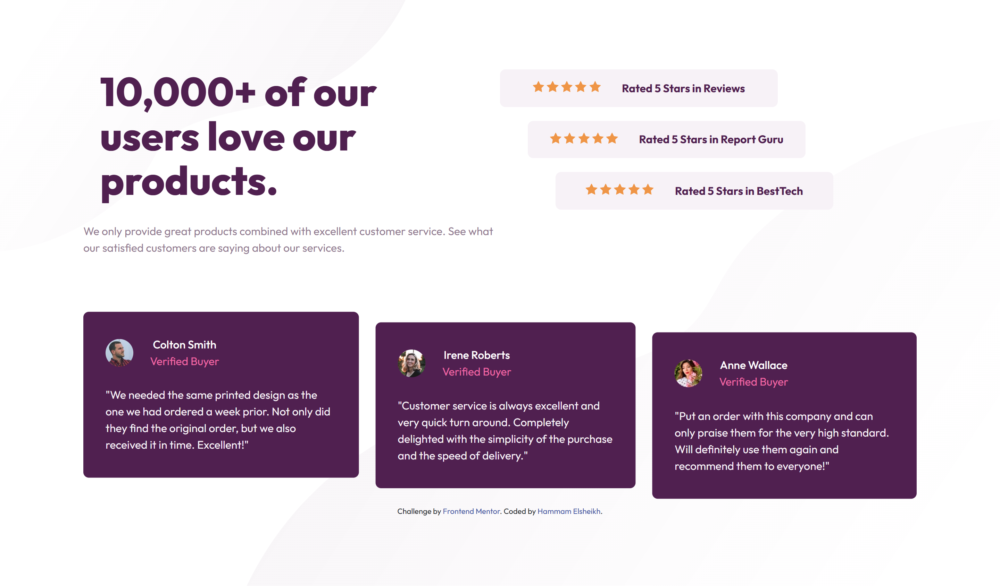

# Frontend Mentor - Social proof section solution

This is a solution to the [Social proof section challenge on Frontend Mentor](https://www.frontendmentor.io/challenges/social-proof-section-6e0qTv_bA). Frontend Mentor challenges help you improve your coding skills by building realistic projects.

## Table of contents

- [Overview](#overview)
  - [The challenge](#the-challenge)
  - [Screenshot](#screenshot)
  - [Links](#links)
  - [Built with](#built-with)
  - [What I learned](#what-i-learned)
- [Author](#author)

## Overview

### The challenge

Users should be able to:

- View the optimal layout for the section depending on their device's screen size

### Screenshot

### Links

- [Solution URL](https://github.com/hammam-elsheikh/social-proof-section)
- [Live Site URL](https://your-live-site-url.com)

### Built with

- Semantic HTML5 markup
- scss
- Flexbox
- CSS Grid

### What I learned

linear gradient background between two pics

## Author

- Frontend Mentor - [@hammam-elsheikh](https://www.frontendmentor.io/profile/hammam-elsheikh)
- Twitter - [@hammamelsheikh](https://www.twitter.com/hammamelsheikh)
